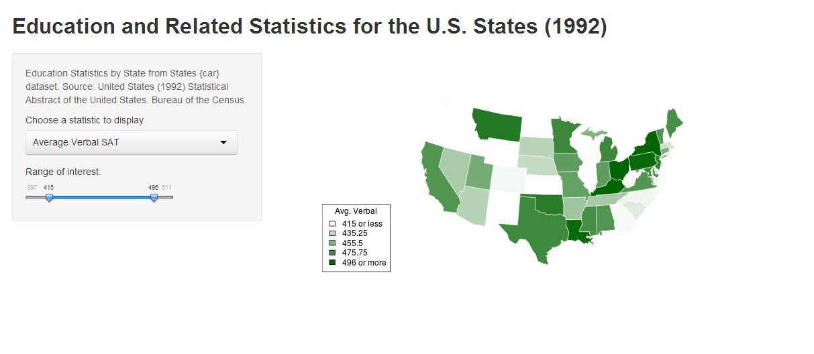

## Application Overview

- Dynamic map displays selected variables from data set
- Slider input allows selection of range of values displayed
- Uses reactive server code to dynamically set ranges for selected variables

---
## Sample Screen

---
## Data Source

* Source data is from the Companion to Applied Regression (car) package
    * States data set:
        - United States (1992) Statistical Abstract of the United States. Bureau of the Census

--- &radio
## Which state had the highest average Verbal SAT scores in 1992?

1. New York
2. _Iowa_
3. California
4. Texas

*** .hint
Think Midwestern

*** .explanation
That's right. Iowa also had the highest average Math SAT scores.

